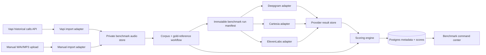
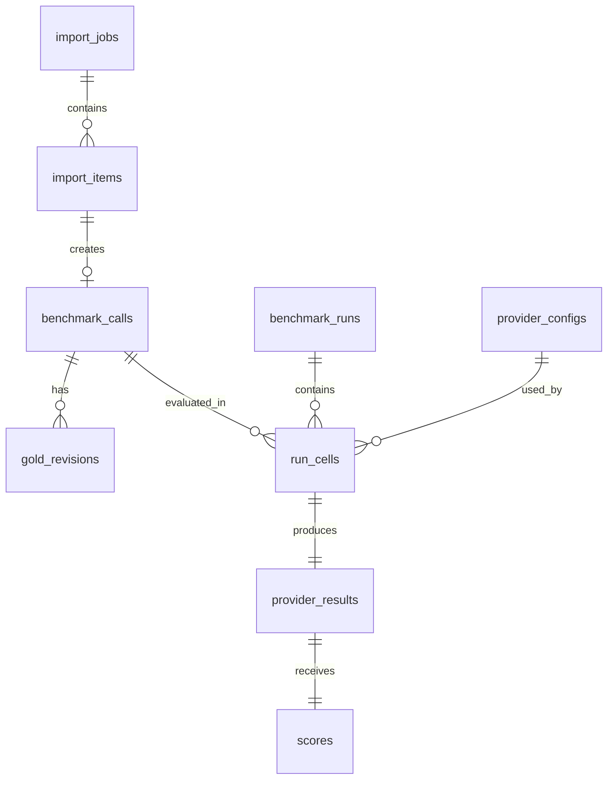

# Standalone Vapi Transcriber Benchmark — Architecture Handoff

**Status:** implementation-ready architecture; no provider runner is implied by this document.  
**Scope:** import a bounded date range of historical Vapi call recordings, replay the same audio through Deepgram, Cartesia, and ElevenLabs STT, score against human-reviewed references, and make a defensible default-transcriber decision from real agent audio.

This document supersedes the provider scope in the earlier general PRD for the first implementation. The broader provider matrix remains a future expansion reference.

---

## 1. Product boundary

This is a **standalone internal benchmark application**, separate from production call handling and separate from the agent runtime.

It does **not** replace Vapi, make calls, route live traffic, or change production transcriber settings. It consumes historical, approved recordings and produces evidence for that later decision.

### First release

- Pull call metadata and recordings for a user-selected Vapi date range.
- Accept manual audio upload as an emergency/backfill path.
- Preserve the original audio once and replay those exact bytes to every candidate.
- Evaluate Deepgram, Cartesia, and ElevenLabs STT.
- Store provider-native results, normalized results, scoring evidence, cost inputs, and run manifests.
- Present a per-vertical recommendation with raw metrics behind it.

### Explicitly out of scope for the first release

- Auto-switching the production Vapi transcriber.
- Sending live or in-progress calls to multiple providers.
- LLM-based transcript “correction” before scoring.
- Trusting a vendor transcript as the gold reference.
- Mixing different recordings between providers in the same benchmark run.

---

## 2. System context



### Non-negotiable comparison rule

Every provider × call cell in a run receives:

1. the same object-store audio path and SHA-256 hash;
2. the same decoded audio duration;
3. a versioned provider configuration;
4. the same scoring version; and
5. the same gold transcript and entity annotations.

If any condition differs, the cell is not comparable and the run must surface it as invalid rather than produce a ranking.

---

## 3. Integration strategy

### 3.1 Runtime rule: direct API or native connector, never MCP

MCP tools are available to agents in a managed conversation; they are **not callable by a deployed browser or API server**. Therefore:

| Capability | Runtime approach | Why |
|---|---|---|
| Vapi recording import | Direct Vapi REST adapter | No Vapi native connector was found during architecture discovery. |
| Deepgram transcription | Direct provider adapter | Keeps the benchmark deterministic and independent of agent tooling. |
| Cartesia transcription | Direct provider adapter | Same reason; pin the model and request shape in the run manifest. |
| ElevenLabs transcription | Native ElevenLabs connector **or** direct provider adapter | A native ElevenLabs connector is available, but the adapter contract must not depend on it. |
| Chat-side research/admin assistance | MCP where available | Useful for an agent, never for the production benchmark runner. |

**Decision gate:** if a native connector exists and supports the exact required endpoint, authentication pattern, and data-policy requirements, it may back a provider adapter. The adapter interface and persisted result shape must remain identical to the direct-API implementation.

### 3.2 Secret and connection boundaries

Store credentials only in the application secret manager. Store **secret references** and connector identifiers in configuration, never secret values.

| Integration | Required configuration | Stored in run manifest? |
|---|---|---|
| Vapi | `VAPI_API_KEY` reference, API base URL, import filter policy | API version + filter + imported call IDs; never key |
| Deepgram | `DEEPGRAM_API_KEY` reference, model, endpoint options | Model + non-secret request options |
| Cartesia | `CARTESIA_API_KEY` reference, model, endpoint options | Model + non-secret request options |
| ElevenLabs | connector ID or `ELEVENLABS_API_KEY` reference, model/options | Connector/direct mode + model + non-secret options |
| Object store | platform-managed private storage | Object path and SHA-256 only |

No call audio, transcript, URL query string, authentication header, or raw token may appear in application logs.

---

## 4. Vapi ingestion architecture

### 4.1 Import modes

| Mode | Purpose | Trigger | Output |
|---|---|---|---|
| `vapi_range_pull` | Normal weekly or fortnightly import | Operator selects start/end, vertical mapping, and optional call filters | Imported-call manifest plus private audio objects |
| `manual_upload` | Backfill, one-off candidate, or Vapi export fallback | Operator uploads approved file(s) and metadata | Same corpus record shape as Vapi import |

The two modes converge immediately after normalization. Downstream code must not care which import mode produced an audio object.

### 4.2 Vapi import sequence

1. Operator selects an inclusive start and exclusive end timestamp.
2. Import service lists eligible calls through Vapi pagination and records the cursor/checkpoint.
3. Service applies local selection rules: duration bounds, terminal call state, duplicate protection, and optional vertical tags.
4. Service creates an `import_item` for each candidate **before** downloading audio.
5. Service resolves the recording URL, downloads the bytes once, computes SHA-256, and saves to private object storage.
6. Service creates a `benchmark_call` in `needs_review` state; no imported call is automatically ready to run.
7. Curator reviews de-identification and either approves, redacts/replaces, or archives the item.
8. Import summary records counts for discovered, skipped, downloaded, duplicate, failed, and awaiting review.

### 4.3 Idempotency

Use `vapi_call_id` as the primary deduplication key when present. Also store `audio_sha256`; a matching hash across different call IDs is a warning, not an automatic merge.

`import_job` is resumable from a checkpoint. Retrying a failed item must not create a second corpus call or a second object unless the first object failed integrity verification.

### 4.4 Manual upload sequence

1. Browser requests a pre-signed private object-storage URL.
2. Browser uploads bytes directly to object storage; it does not proxy audio through the web server.
3. API verifies content type, size, duration extraction, and SHA-256.
4. Operator provides a de-identified label, vertical, hard-case tags, and import attestation.
5. API creates the same `benchmark_call` and `import_item` shape used by Vapi imports.

Manual upload is a fallback, not a weaker data path. It must pass the same review, retention, and audit rules.

---

## 5. Provider adapter contract

Each candidate implements the following server-only contract. The UI never calls a transcription provider directly.

```ts
type ProviderId = "deepgram" | "cartesia" | "elevenlabs";

type ProviderConfigSnapshot = {
  providerId: ProviderId;
  model: string;
  mode: "batch" | "streaming_replay";
  options: Record<string, unknown>; // no credentials
  pricingVersion: string;
  configHash: string;
};

type TranscriptionRequest = {
  runId: string;
  callId: string;
  audioObjectPath: string;
  audioSha256: string;
  durationMs: number;
  config: ProviderConfigSnapshot;
};

type ProviderEvent =
  | { type: "submitted"; at: string }
  | { type: "first_partial"; at: string; text: string }
  | { type: "final"; at: string; text: string }
  | { type: "usage"; audioSeconds: number; billableUnits?: number }
  | { type: "error"; code: string; message: string; retryable: boolean };

type ProviderResult = {
  providerId: ProviderId;
  model: string;
  requestHash: string;
  transcript: string | null;
  diarization?: unknown;
  rawResponseObjectPath: string;
  events: ProviderEvent[];
  usage: { audioSeconds: number; billableUnits?: number };
};

interface TranscriberAdapter {
  readonly id: ProviderId;
  validateConfig(config: ProviderConfigSnapshot): void;
  transcribe(request: TranscriptionRequest): AsyncIterable<ProviderEvent>;
  normalize(events: ProviderEvent[]): Promise<ProviderResult>;
  estimateCost(input: {
    durationSeconds: number;
    config: ProviderConfigSnapshot;
  }): { amount: number | null; currency: "USD"; basis: string };
}
```

### Adapter design rules

- Adapter code accepts a private object path, resolves it server-side, and never exposes provider credentials to the browser.
- Raw provider response is persisted before parsing so scoring can be rerun if normalizers change.
- The `mode` field is a run-level protocol setting. A batch result must record `first_partial = null`, not a fabricated value.
- Any provider-specific boost/custom vocabulary experiment is a separate configuration snapshot and run.
- A provider API failure becomes a failed cell, not a failed run. All other cells continue.
- Provider retries are limited, backoff-based, and recorded. A retry may not replace the original error evidence.

---

## 6. Data model



### Required tables

| Table | Critical fields | Notes |
|---|---|---|
| `import_jobs` | mode, requested range, status, cursor, filter snapshot, summary | One import request, resumable and auditable |
| `import_items` | import job, source call ID, source recording URL hash, audio hash, status | Per Vapi/manual candidate |
| `benchmark_calls` | label, vertical, audio object path/hash, duration, status, hard cases | Approved benchmark corpus only |
| `gold_revisions` | call ID, transcript, entities JSON, author, reviewer, version, hash | Never overwrite a gold reference in place |
| `provider_configs` | provider/model, mode, non-secret options, cost table, config hash, status | Secret reference only |
| `benchmark_runs` | corpus snapshot, provider snapshots, scoring version, protocol version, status | Immutable after creation |
| `run_cells` | run/call/provider config IDs, status, attempt count, timing fields | One comparable provider × call unit |
| `provider_results` | raw object path/hash, normalized transcript, usage, error details | Persist before scoring |
| `scores` | WER, entity metrics, number metrics, diarization metrics, score version | Include structured per-entity evidence |
| `audit_log` | actor, action, object type/ID, redacted before/after | Required for audio and approval events |

### Status machines

```text
Import:     queued → discovering → downloading → awaiting_review → complete | partial | failed
Corpus:     needs_review → ready_for_gold → gold_in_review → ready_to_run → archived
Run:        draft → preflight → queued → running → complete | partial | failed | invalid
Run cell:   pending → submitted → receiving → scored | failed | skipped
```

Only allowed transitions should be implemented. Enforce them in the server service layer, not only as UI affordances.

---

## 7. Run protocol and reproducibility

### Preflight checks

Before creating any run, verify:

- every selected call has an approved gold revision;
- every selected call has a verified audio hash and readable private object;
- every selected provider config is active, non-secret fields are valid, and pricing basis is known;
- all calls have a normalized duration;
- the user has seen the estimated run cost;
- the corpus and config snapshots can be serialized and hashed.

### Immutable run manifest

```json
{
  "protocolVersion": "v1",
  "scoringVersion": "v1",
  "corpus": [
    {
      "callId": "uuid",
      "audioObjectPath": "/objects/...",
      "audioSha256": "sha256",
      "goldRevisionId": "uuid",
      "goldSha256": "sha256"
    }
  ],
  "providers": [
    {
      "providerConfigId": "uuid",
      "provider": "deepgram",
      "model": "exact model string",
      "mode": "streaming_replay",
      "configHash": "sha256",
      "pricingVersion": "vendor-date-or-contract-version"
    }
  ]
}
```

The manifest omits all credentials, signed URLs, and raw customer data beyond the approved benchmark objects.

---

## 8. Scoring architecture

The current `scripts/src/stt-score.ts` is a starting implementation for normalized WER and strict entity matching. Before results are used for a decision, the following gates must be resolved:

| Metric | Primary measure | Required decision before build |
|---|---|---|
| WER | Micro-averaged word error rate | Freeze normalization rules; do not retroactively change them in a run |
| Entity accuracy | Exact match after entity-type-specific normalization | Approve entity taxonomy and gold annotation format |
| Alphanumeric accuracy | Full sequence exact-match rate | Define spoken letter/digit equivalence rules |
| Latency | Harness timestamp to first meaningful partial/final | Confirm batch vs streaming-replay protocol for every provider |
| Cost | Configured/verified rate × audio duration | Define billable-unit conversion and negotiated-rate versioning |
| Diarization | DER/JER only where gold speaker segments exist | Do not report a synthetic zero for unsupported providers |

### Decision rule

Do not choose a single default because of a generic composite score alone. The decision view must show:

1. raw WER;
2. entity and alphanumeric accuracy;
3. p50/p95 latency where comparable;
4. estimated and, if available, billed cost;
5. sample size and hard-case coverage; and
6. a confidence/uncertainty note.

For Rush, the recommendation should explicitly declare the minimum acceptable VIN/RO/unit accuracy before cost can break a tie.

---

## 9. UI modules

The existing command center should be reoriented around these modules:

| Module | Operator outcome | Data source |
|---|---|---|
| Import center | Pull a Vapi date range or upload fallback files, resume/inspect job | `import_jobs`, `import_items` |
| Corpus review | Approve de-identification, tag hard cases, manage gold-review status | `benchmark_calls`, `gold_revisions` |
| Gold editor | Write/review transcript and entity spans, compare revisions | `gold_revisions` |
| Provider configurations | Set model/options, see capability prerequisites, secret/connector readiness | `provider_configs` |
| Run composer | Choose frozen corpus/provider config sets, view preflight/cost, submit run | `benchmark_runs` |
| Run detail | Follow every provider × call cell; inspect raw result and retry evidence | `run_cells`, `provider_results` |
| Rankings | Compare metrics by vertical, hard case, and provider; export decision evidence | `scores` |
| Audit/export | Retrieve run manifest, score export, and review trail | all append-only records |

---

## 10. Build order

1. Resolve data handling, retention, Vapi access, and provider terms.
2. Build the Vapi/manual import boundary and private audio storage.
3. Build gold-revision and entity-annotation workflow.
4. Freeze scoring protocol and test it with synthetic fixtures.
5. Build the provider adapter interface and Deepgram adapter first.
6. Add Cartesia and ElevenLabs adapters using the identical interface.
7. Build run/cell orchestration, immutable manifest, and result persistence.
8. Surface the run and ranking UX.
9. Run 10–15 manually approved calls.
10. Scale only after an independent rerun reproduces the first result.

Detailed microtasks, dependencies, and logic gates are in `docs/execution-plan.md`, `docs/tasks.yaml`, and `docs/logic-register.md`.

---

## 11. Ownership and handoff checklist

Before coding any integration, the next engineer should obtain:

- Vapi API documentation/version and an approved, least-privilege credential route.
- Confirmation of the exact Vapi resource fields that identify recordings and call timestamps.
- Provider account credentials or approved native connector setup for the three candidates.
- Provider data-processing and no-training/retention terms acceptable for the approved corpus.
- A written gold-transcript style guide.
- An approved hard-case taxonomy and minimum sample allocation per vertical.
- A named owner for scoring-normalization, ranking weights, and production-switch decision.

Do not collect production calls or issue provider requests until these ownership items are closed.